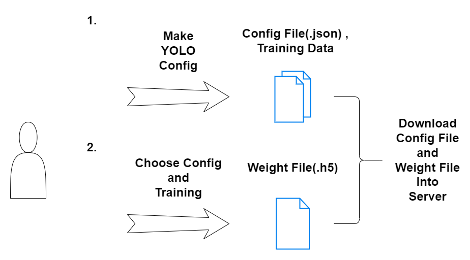
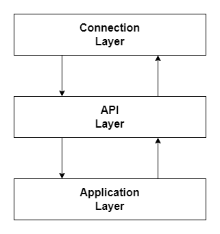

# Server

### Socket I/O

輸入:先接受4個Byte，並且轉換成整數N，接受整數N個Bytes(UTF-8)，轉換成字串M，最後將M解析成JSON格式，再次循環。  
輸出:將JSON解析成字串，再轉換成Bytes M，計算M的長度N，傳送N(4 Bytes)，傳送M(N Bytes)，再次循環。  

### Software Architecture

### Train yolo

### Layer

### Remote detect

由於在Jetson nano GPU上使用YOLOv4偵測影像，會導致一個我們無法修復的BUG，我們有兩個解決方案。

1. 使用CPU運算，但是FPS會大幅減少(YOLOv4 Tiny FPS ~= 1)
2. 建立一個專門負責YOLO運算的伺服器，將影像傳回伺服器偵測，必且取回結果，再連同影像以及結果傳回客戶端, FPS取決於伺服器的運算能力，與此同時網路的連線品質也會影響到FPS的高低。

### Thread diagram

