### TCP/IP Socket

伺服器與手機之間我們用TCP/IP的通訊協定,進行兩邊的訊息交換。Socket的訊息傳遞皆是Byte,假設我們要傳遞一個字串,我們就要把字串編碼成Byte,再以Socket傳遞出去。訊息的長度如果是固定的話,我們可以每次傳送與接收固定長度的Bytes即可,但是在實作中很難確保要傳送與接收的訊息長度都是固定的,於是要達成可以接收非固定長度的訊息,我們在傳送、接收訊息本體前,先傳送或接收一個標頭,我們將標頭的長度設定於固定的4個Byte,以這個標頭來代表一個整數,這個整數又代表了訊息長度,如此一來,只要花費極少的傳輸量即可以讓我們的訊息可以用非固定的長度進行傳輸。
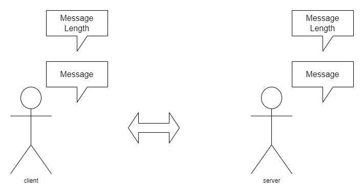

### 更有彈性的訊息格式JSON

我們希望我們所傳遞的訊息能夠有更好的彈性,不只是單純傳送一段文字,而是這段文字可以表達成更多的資料型態,比如說可以是陣列、整數、浮點數、布林值或是一個物件,於是我們使用JSON來作為訊息的格式,除此之外,在每個JSON訊息定義一個固定的鍵,對應到一個值,這個值用來辨別此訊息用途。

```json
{
  "CMD": "MOV",
  "R": 0,
  "THETA": 0
}
```

以我們實作為例子,每個JSON都定義一個`CMD`的鍵值,這個鍵值對應到一個字串`MOV`,接著透過約定好的API存取`R`,`THETA`的值即可。
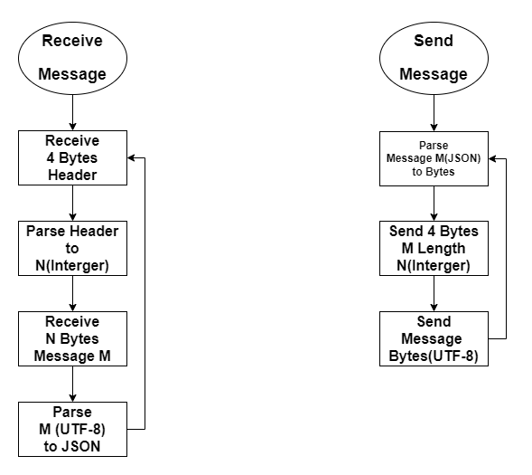

### I/O平行處理

我們不希望需要等待接收一個訊息的時間,處理完這個訊息,再等待傳送訊息的時間,這會讓程式的大部分時間都在等待I/O,最好是I/O可以平行處理,要做的這一點的話,我們需要建立I/O的緩衝區,以及創建兩個執行緒,一個用來負責接收,一個用來傳送,負責接收的執行緒重複將接收的訊息放入輸入緩衝區;負責傳送的執行緒重複從輸出緩衝區取得訊息並且傳送。
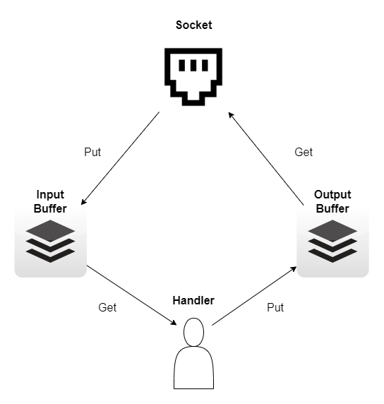

### 影像串流

上述我們通過JSON傳遞一些簡易的訊息,那我們要如何傳遞一張圖片呢?首先一張圖片由一個三維陣列組成(高,寬,3),我們一開始的構想是將圖片上每一個元素直接傳送過去,依據約定好的解析度大小,每個點依序填上顏色,每個點(Pixel)
會需要3個Byte,以一張500*500解析度的圖片為例,會需要500 *500 *3 = 0.75MB,如果一秒內要傳送30張圖片會需要22.5MB,這對於客戶端以及伺服器端的硬體設備有相當大的要求。

```json
{
  "CMD": "FRAME",
  "IMAGE": "Base64 JPG String",
  "BBOX": []
}
```

我們的解決辦法是將圖片使用OpenCV函式庫轉換成JPG格式,將JPG轉換成Byte,以Base64編碼格式將Byte轉換成字串,客戶端只要反向就可以還原成原始的圖片,這樣能大幅降低傳送圖片所需要的成本,不過要是JPG還是過於龐大,則需要更進一步壓縮。

| Original Image(500*500)   | JPG q=95       | JPG q=50       |
|---------------------------|----------------|----------------|
| 750,000 Bytes             | 75,036 Bytes   | 19,612 Bytes   |

### 攝影機

CSI Camera,依據解析度的不同會有或高或低FPS,我們在這選擇1280 * 720,
60FPS,以OpenCV函式庫控制攝影機的讀取。在這裡我們把更新策略分為主動更新以及被動更新,主動更新的策略是新建立一條獨立的執行緒,以迴圈方式持續讀入每一幀(Frame)
存放到變數中,當外部要取得影像時,可以幾乎沒有任何延遲即可返回該幀;被動更新的策略是每當外部呼叫取得影像才執行攝影機讀取的動作,等到讀取時間結束後才會回傳該幀。主動更新的好處在於延遲較低,被動更新的好處是使用資源較少、執行緒管理比較輕鬆。我們是選擇主動更新,實際測試後並不會占用過多資源。
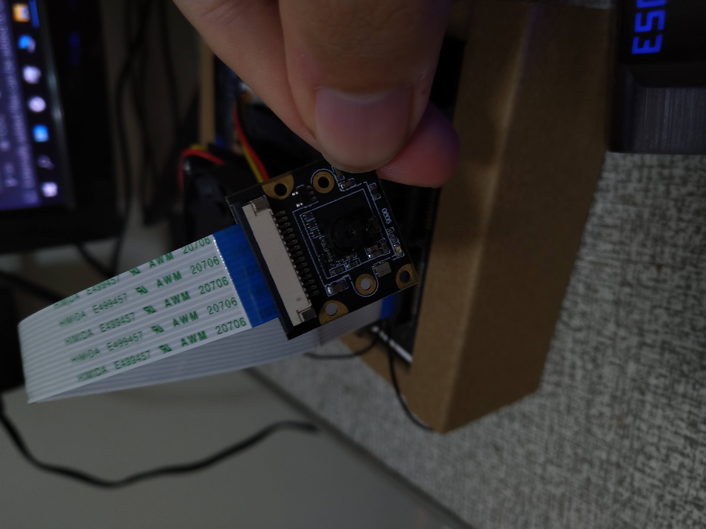

### LED螢幕

Adafruit PiOLED,解析度128 *
32,使用官方提供的函式庫控制,主要用來顯示IP位址提供給客戶端連線,以及提供一些最基本的Debug能力,判斷伺服器是否有在運作,目前有沒有客戶端連接上了伺服器,以及顯示伺服器的啟用時間、客戶端的連線時間。
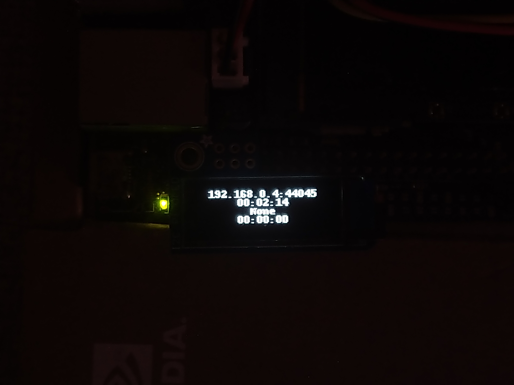

### PWM

以Jetson
nano預設的函示庫控制各個腳位的GPIO高低電位,其中有兩個馬達需要控制,行進角度以及轉速,每個馬達都有一個獨立的執行緒在負責,其中我們又新增一個專門重置PWM馬達的執行緒,每當一段時間使用者沒有去操控馬達,就會將馬達還原成原始狀態,以確保硬體設備的安全。

### YOLOv4

為什們我們選擇了YOLOv4作為辨識物體的演算法?

1. 辨識物體快速
2. 網路相關資源多

原生的YOLO以Darknet的架構為主,使用C語言編寫,但是我們希望可以用Python語言為主的架構實現,這樣對於控制其他元件(Camera,Led Monitor, GPIO...等)
較為容易,於是我們挑選上了在Github上以Tensorflow實現YOLOv4的專案進行改良,我們改良的點在於:

1. 修正Bug
2. 減少命令列參數
3. 將每個訓練模型的參數用一個JSON檔統一管理
4. 減少第三方函式庫依賴
5. 訓練失敗時,可以輕鬆的復原訓練
6. 快速部屬模型

### 訓練客制化模型

到MS COCO下載訓練檔案後,修改`sys.ini`檔案。

```ini
[Annotations]
train_set_dir = /mnt/f/train2014
train_annotation_path = /mnt/f/instances_train2014.json
test_set_dir = /mnt/f/val2014
test_annotation_path = /mnt/f/instances_val2014.json

[Save_dir]
checkpoints = checkpoints
weights = weights
configs = configs
logs = logs
train_processed_data = data/bbox/train
test_processed_data = data/bbox/test
```

新增一個`models.txt`。

```text
person
car
horse
```

製作一個設定檔。

```
$ python3 makeYoloConfig.py my-model-name models.txt
2022/05/21 09:41:31 INFO: System config file path: /mnt/f/alt/TrainYolo/sys.ini
2022/05/21 09:41:31 INFO: Make dir /mnt/f/alt/TrainYolo/configs
2022/05/21 09:41:31 INFO: Make dir /mnt/f/alt/TrainYolo/checkpoints
2022/05/21 09:41:31 INFO: Make dir /mnt/f/alt/TrainYolo/weights
2022/05/21 09:41:31 INFO: Make dir /mnt/f/alt/TrainYolo/data/bbox/train
2022/05/21 09:41:31 INFO: Make dir /mnt/f/alt/TrainYolo/data/bbox/test
2022/05/21 09:41:31 INFO: Make dir /mnt/f/alt/TrainYolo/logs/my-model-name
2022/05/21 09:41:31 INFO: Start loading annotation file: /mnt/f/instances_train2014.json
2022/05/21 09:41:31 INFO: Start loading annotation file: /mnt/f/instances_val2014.json
2022/05/21 09:41:35 INFO: loading annotation file: /mnt/f/instances_val2014.json finish
2022/05/21 09:41:43 INFO: loading annotation file: /mnt/f/instances_train2014.json finish
2022/05/21 09:41:46 INFO: my-model-name.bbox have 200 images
2022/05/21 09:41:48 INFO: my-model-name.bbox have 1000 images
.
..
...
2022/05/21 09:41:49 INFO: Write YOLO Config to /mnt/f/alt/TrainYolo/configs/my-model-name.json
```

開始訓練,如果訓練期間失敗的話,再重新執行一次即可。

```commandline
python3 train.py ./configs/my-model-name.json
```

訓練結束後(又或是到達存檔點),你可以在相對應的資料夾找到設定檔以及權重檔,將檔案移至伺服器內相同的位置,下次啟動伺服器時就可以自動部屬這些模型了。

```
$ tree configs/ weights/
configs/
└── my-model-name.json
weights/
└── my-model-name.h5
```

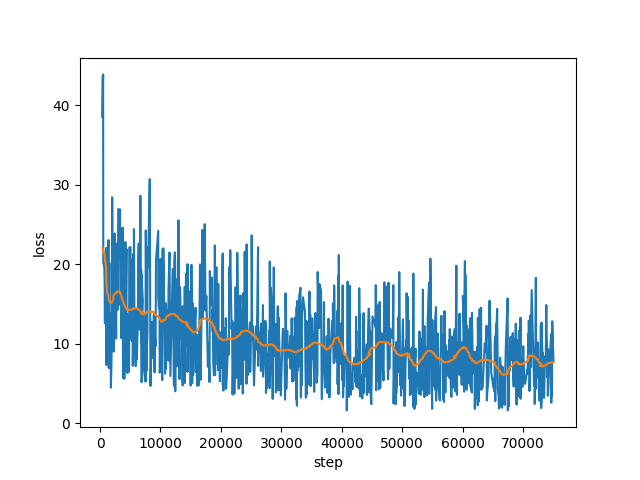
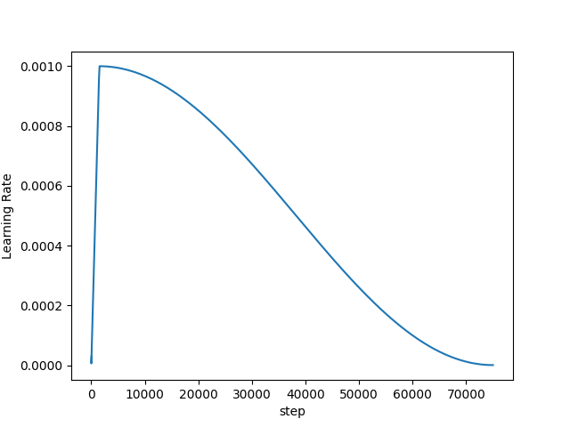

### 平行化運算

為了達到最好的反應時間,我們在上面提到以攝影機主動更新的方式降低讀取時間,但其實還有一點小空間可以提升反應時間,就是將影像編碼與辨識物件的動作平行化處理,不過編碼的時間對於辨識的時間幾乎可以忽略不計,所以實際看起來效果幾乎沒什麼不同。

### 不可避免的Error

我們一開始的初衷是利用Jetson
nano上的GPU來進行YOLO的運算,但是經過我們的測試發現,使用GPU運算時,總是會發生我們無法修復的錯誤,原因大概是YOLO模型要求過多CUDA資源導致,要修改Tensorflow或是CUDA對我們來說是不可能的任務,於是我們做出了兩個取代方案。

### 取代方案

1. 開設一個專門辨識的伺服器,將Jetson nano所拍攝到的影像傳回伺服器,以伺服器代理Jetson nano的辨識功能。
2. 以Jetson nano的CPU進行運算。

方案一需要多架設一個伺服器,並且辨識效能也會因為傳遞影像的時間所影響,也多出了開發成本以及硬體成本,不過至少能接近我們原本專案的目的;方案二在實現上只要添加一行短短的程式碼就可以達成,但CPU終究無法展現出YOLO模型的強大,FPS會大幅度的降低,對於客戶端來說,體驗並不是很好。當然,兩種方案是可以啟動時選擇的,只是方案一啟動時要先確保辨識伺服器的可用。
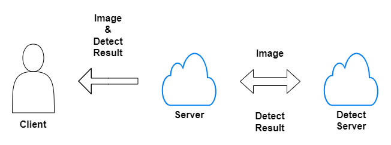

### 效能測試

| Models on GTX1060 | size | time(second) | FPS   |
|-------------------|------|--------------|-------|
| v4-320            | 320  | 0.182        | 5.46  |
| v4-416            | 416  | 0.195        | 5.12  |
| v4-tiny-416       | 416  | 0.054        | 18.41 |

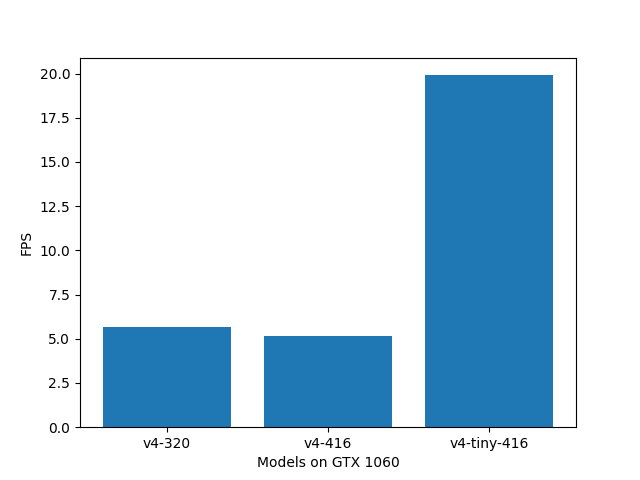

### 啟動

修改`sys.ini`

```ini
[Server]
ip = 0
port = 0
server_timeout = 300
client_timeout = 60
is_show_exc_info = True
log_level = 20

[PWM]
pwm_speed_port = 37
pwm_angle_port = 38
frequency = 0.25
is_pwm_listen = False

[Streamer]
max_fps = 30
idle_interval = 1
timeout = 10
jpg_encode_rate = 50

[Detector]
configs = configs/
is_local_detector = True
detect_server_ip = 192.168.0.2
detect_server_port = 5050

```

```commandline
python3 main.py
```

### 軟體架構
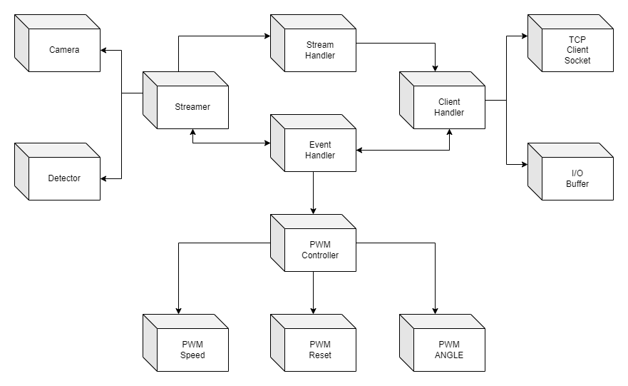

### 執行緒時序
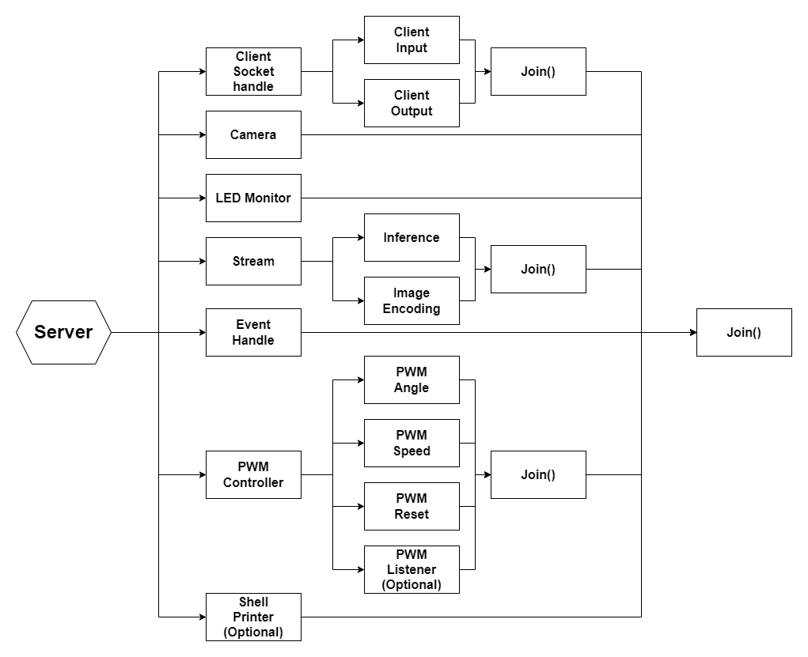